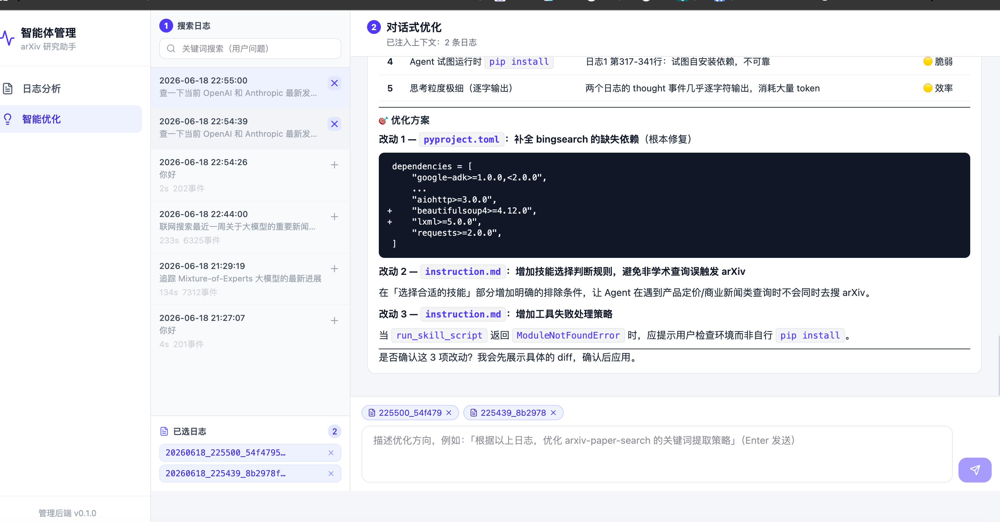

# 学术论文研究智能体

基于 Google ADK + DeepSeek 构建的学术论文研究智能体，支持**arXiv 论文检索、网页搜索、文件上传问答**，并内置**任务规划、终端执行、代码执行、图片分析（OCR）、人在回路澄清**等智能体能力。通过**旁路解说架构**将 Agent 的工具调用与思考过程翻译为通俗易懂的中文卡片，让非技术用户也能理解 AI 的分析过程。

---

## 功能概览

| 功能 | 说明 |
|------|------|
| **arXiv 论文检索** | 接入 arXiv 公开 API，支持按相关性/最新提交并行检索、按分类/作者检索、自由检索表达式 |
| **网页搜索** | 自建 SearXNG 实例，支持通用/新闻/图片/视频搜索，自动重试与诊断 |
| **文件上传问答** | 支持 PDF、PPTX、PPT、TXT 文件上传，自动提取内容并带位置标记（`[第X页]`、`[幻灯片X]`）注入 LLM 上下文 |
| **任务规划（todo）** | 面对多步骤研究任务，Agent 先拆解出待办清单并逐步推进、实时更新进度 |
| **终端执行（terminal）** | 在服务器上执行 shell 命令，查看环境、运行脚本、读取文件 |
| **代码执行（code）** | 内置 Python 代码执行器，自动编写并运行代码做数据统计与计算，过程同样以解说卡片展示 |
| **图片分析 / OCR（vision）** | 上传截图、图表、结果表、扫描件等图片，调用独立视觉模型理解内容或提取文字（DeepSeek 无视觉能力，单独配置 qwen-vl-max） |
| **人在回路澄清（clarify）** | 需求模糊或缺关键信息时，Agent 主动反问澄清，用户回答后无缝续接同一会话继续执行 |
| **旁路解说** | 工具调用和思考过程被翻译为友好的中文卡片，实时推送给前端 |
| **SSE 流式输出** | 6 种事件类型实时推送，前端逐字打字机效果展示 |
| **SSE 响应缓存** | 相同问题秒级回放缓存结果（持久化到 `cache/` 目录，TTL 24h、LRU 淘汰） |
| **会话日志** | 每轮对话完整记录到 JSONL 文件，含事件历史、耗时、元数据 |
| **管理端** | 独立管理面板：Agent 配置编辑与版本回滚、技能管理、日志分析、LLM 智能优化建议 |

---

## 效果演示


> 以下为示例查询，展示智能体的完整工作流程。

**查询**：对比 RAG 与长上下文窗口在知识密集型任务上的优劣

### 思考过程（旁路解说翻译后）

```
🧠 根据研究问题制定检索策略
🧠 分析主要实验结果与评测指标
```

### 工具调用过程（解说卡片）

```
[1]  📖 加载技能指导 …
       读取论文检索技能的详细分步指导

[2]  📖 加载技能指导 - 完成 ✓
       返回结构化数据，包含 3 个字段: skill_name, instructions, frontmatter

[3]  🔧 执行检索脚本 …
       正在执行 run_skill_script

[4]  🔧 执行检索脚本 …
       正在执行 run_skill_script

[5]  🔧 执行检索脚本 - 完成 ✓
       脚本执行成功，stdout 输出 28,114 字符

[6]  🔧 执行检索脚本 - 完成 ✓
       脚本执行成功，stdout 输出 31,902 字符
```

### 检索策略（智能体自动制定）

| 检索维度 | 工具 | 检索内容 |
|----------|------|----------|
| 综合论文 | arxiv-paper-search (all) | retrieval augmented generation + long context |
| 最新进展 | arxiv-paper-search (recent) | long context language model |
| 代码/解读 | searxng (general) | RAG vs long context window benchmark |

### 回答正文（节选）

> #### 两种范式的核心差异
>
> **RAG（检索增强生成）** 在推理时从外部知识库检索相关片段拼接到提示中，知识可随时更新、单次上下文成本低；**长上下文窗口** 则将全部材料直接放入模型上下文，省去检索环节、保留完整篇章结构 [1][2]。
>
> #### 在知识密集型任务上的对比
>
> | 维度 | RAG | 长上下文窗口 |
> |------|-----|-------------|
> | 知识更新 | 实时，无需重训 | 受窗口与训练数据限制 |
> | 推理成本 | 低（只注入相关片段） | 高（随长度平方增长） |
> | 长程依赖 | 受检索召回影响 | 完整保留篇章结构 |
> | 典型失败模式 | 检索召回不全 | lost in the middle |

**流结束统计**：正文约 6,000 字符 · 2 个工具步骤 · 6 张解说卡片

---

## 架构设计

```
用户提问
    │
    ▼
┌──────────────────────────────────────────────────────┐
│                  主 Agent (DeepSeek)                   │
│     （arXiv 论文检索、网页搜索、文件分析、深度思考）          │
└──────────┬──────────────┬──────────────┬─────────────┘
           │              │              │
     ┌─────▼─────┐  ┌────▼─────┐  ┌─────▼─────┐
     │ 正文回复   │  │ 思考过程  │  │ 工具调用   │
     │ (text)    │  │(thought) │  │(tool_step)│
     └─────┬─────┘  └────┬─────┘  └─────┬─────┘
           │              │              │
           │        ┌─────▼─────┐  ┌─────▼──────┐
           │        │ 旁路解说   │  │ 旁路解说    │
           │        │ 翻译思考   │  │ 翻译工具    │
           │        └─────┬─────┘  └─────┬──────┘
           │              │              │
           ▼              ▼              ▼
     ┌─────────┐  ┌────────────┐  ┌────────────┐
     │ 最终答案 │  │ 🧠 思考卡片 │  │ 🔬 工具卡片 │
     │ 流式展示 │  │ 通俗中文    │  │ 友好标签    │
     │ 给用户   │  │ 解说       │  │ 进度展示    │
     └─────────┘  └────────────┘  └────────────┘
           │              │              │
           └──────────────┼──────────────┘
                          ▼
                   SSE 流式推送 → React 前端
```

### 旁路解说：三个回调钩子

| 回调 | 触发时机 | 作用 |
|------|---------|------|
| `before_tool_callback` | 工具执行前 | 告诉用户"即将做什么"（`status: "running"`） |
| `after_tool_callback` | 工具执行后 | 告诉用户"做了什么，结果如何"（`status: "done"`） |
| `after_model_callback` | LLM 每次响应后 | 将思考过程翻译为通俗说明 |

**设计原则**：解说只翻译过程，绝不触碰正文输出；解说失败静默捕获，绝不影响主 Agent。

---

## 智能体能力（工具）

除两个检索技能（arXiv 论文检索、网页搜索）外，Agent 还内置以下通用工具，定义在 `backend/app/tools.py`，并在 `backend/app/agent.py` 中注册：

| 工具 | 类型 | 说明 |
|------|------|------|
| `todo` | 任务规划 | 拆解复杂任务为待办清单并跟踪进度，状态存于会话 state（单轮会话内有效） |
| `terminal` | 终端执行 | `subprocess` 执行 shell 命令，返回 stdout/stderr/returncode（高权限，请在受信部署边界内使用） |
| `execute_code` | 代码执行 | Google ADK 内置 `UnsafeLocalCodeExecutor`，自动编写并运行 Python 代码处理数据/计算 |
| `vision_analyze` | 图片分析/OCR | 通过独立视觉模型（默认 qwen-vl-max）分析图片或提取文字，支持图片 URL 或已上传文件名 |
| `clarify` | 人在回路 | `LongRunningFunctionTool`，向用户提问澄清后挂起，等待回答再续接同一会话 |

### 人在回路（clarify）工作流

```
用户提问（模糊）
    │
    ▼  Agent 判断需求不明确，调用 clarify
SSE 事件 clarify {session_id, call_id, question, choices[]}
    │
    ▼  前端渲染澄清卡片（问题 + 选项按钮 + 自由输入）
用户回答
    │
    ▼  POST /chat/answer  以 function_response 回灌同一 session_id
SSE 续接（text / thought / tool_step ... / done），无缝继续执行
```

> 实现要点：`/chat/stream` 与 `/chat/answer` 共用核心流式 helper `_run_agent_stream(...)`；
> 由于澄清回答无法被缓存回放，clarify 触发的会话**跳过 SSE 缓存**。

### 演示示例

前端欢迎页内置了覆盖上述能力的示例问题，点击即可体验（带文件的示例会自动上传内置 demo 文件）：

| 示例问题 | 演示能力 |
|----------|---------|
| 帮我对比一下**这两个方向**的代表性工作，给出选型建议 | clarify（未指明对象 → 反问澄清） |
| 系统调研扩散语言模型的发展脉络，分阶段梳理并形成综述 | todo（多步任务规划） |
| 检索 MoE 论文并用 Python 统计其按年份的数量分布 | execute_code（代码执行） |
| 看看服务器运行环境：Python 版本和主要科学计算库 | terminal（终端执行） |
| 识别这张基准测试结果表中的数据，并补充该评测的代表性论文 | vision/OCR（自动上传图片） |

---

## 项目结构

```
arxiv-research-agent/
├── .env                          # 环境变量（API Key、端口等）
├── Dockerfile                    # 生产镜像（Python 3.12 + Node 20 + Gunicorn）
├── docker-compose.yml            # 容器编排（2 CPU、2G RAM）
├── start.sh                      # 本地开发一键启动（后端 + 前端）
├── start_manage.sh               # 管理服务一键启动（管理后端 + 管理前端）
├── deploy.sh                     # 生产部署（git pull → docker build → 健康检查）
│
├── backend/
│   ├── pyproject.toml            # Python 依赖（hatchling 构建）
│   ├── server.py                 # FastAPI 服务端（SSE 流式、文件上传、缓存）
│   ├── client.py                 # CLI 客户端（模拟前端，消费 SSE）
│   ├── app/
│   │   ├── agent.py              # Agent 定义（DeepSeek + 技能 + 工具 + 回调）
│   │   ├── tools.py             # 自定义工具：todo / terminal / vision_analyze / clarify
│   │   ├── create_model.py      # 模型工厂（10+ 供应商，统一走 LiteLLM）
│   │   ├── narrator.py           # 旁路解说回调逻辑（三回调 + 格式化）
│   │   ├── narrator_rules.py    # 解说规则：TOOL_LABELS 工具标签 + 思考翻译模式
│   │   ├── file_reader.py        # PDF/PPTX/PPT/TXT/图片 文件提取（带位置标记）
│   │   ├── instruction.md       # Agent 系统提示词（中文）
│   │   └── skills/
│   │       ├── arxiv-paper-search/       # arXiv 学术论文检索
│   │       └── bingsearch/               # Bing 网页搜索
│   ├── cache/                    # SSE 响应缓存（JSON 文件）
│   ├── logs/                     # 会话日志（JSONL）
│   └── uploads/                  # 用户上传文件
│
├── frontend/
│   ├── package.json              # Node 依赖
│   ├── vite.config.ts
│   ├── public/demo/             # 内置演示文件（PPT、基准结果表图片）
│   └── src/
│       ├── App.tsx               # 主界面（时间线、工具卡片、思考卡片、澄清卡片、Markdown）
│       ├── api.ts                # SSE 客户端（streamChat/answerChat）、文件上传/列表/清理 API
│       └── index.css             # Tailwind + 自定义样式
│
├── manage_backend/               # 管理后端（FastAPI，端口 8686）
│   ├── server.py                 # 管理服务端（Agent 配置、技能管理、日志分析、智能优化）
│   ├── app/
│   │   └── config.py             # 路径配置（指向主 backend 的文件系统）
│   └── data/                     # 版本历史快照（agent_versions/、skill_versions/）
│
├── manage_frontend/              # 管理前端（React + Vite，端口 3686）
│   ├── package.json
│   ├── vite.config.ts
│   └── src/
│       ├── App.tsx               # 路由 + 侧边栏布局
│       └── pages/
│           ├── AgentPage.tsx     # Agent 配置编辑 + 版本回滚
│           ├── SkillsPage.tsx    # 技能列表 + 新建/删除
│           ├── SkillDetailPage.tsx # 技能详情（SKILL.md 编辑 + 脚本管理）
│           ├── LogsPage.tsx      # 日志浏览 + 聚合分析
│           └── OptimizePage.tsx  # LLM 驱动的智能优化建议
│
├── test/                         # 集成测试（pytest + httpx）
│   ├── test_specific_question.py # 论文问答 + 缓存测试
│   └── test_ppt_qa.py            # PPT 上传 + 幻灯片引用问答测试
│
└── docs/                         # 设计文档
```

---

## 快速开始

### 本地开发

```bash
# 1. 后端依赖
cd backend
uv sync

# 2. 前端依赖
cd ../frontend
npm install

# 3. 配置环境变量
cp backend/env_example backend/.env
# 编辑 backend/.env，填入 DEEPSEEK_API_KEY

# 4. 一键启动（后端 :8585 + 前端 :3585）
./start.sh

# 或分别启动：
cd backend && uv run python server.py --port 8585    # 后端
cd frontend && npm run dev                            # 前端（自动代理到后端）

# 5. 管理服务（可选）
./start_manage.sh                                     # 管理后端 :8686 + 管理前端 :3686
```

### CLI 客户端（无需前端）

```bash
cd backend
python client.py                              # 交互模式
python client.py "分析销售数据"                 # 自定义查询
python client.py --verbose "研究 AI 趋势"     # 显示原始思考（调试用）
```

### Docker 部署

```bash
# 配置 .env（DEEPSEEK_API_KEY 必填）
./deploy.sh    # 完整流程：环境检查 → git pull → docker compose up → 健康检查

# 或手动：
docker compose up --build -d    # 容器端口 8046
```

### 运行测试

```bash
cd test
pytest test_ppt_qa.py -v                    # PPT 上传 + 问答测试
pytest test_specific_question.py -v         # 论文问答 + 缓存测试
TEST_SERVER_URL=http://host:port pytest . -v  # 对远程服务器测试
```

---

## API 接口

| 方法 | 路径 | 说明 |
|------|------|------|
| `GET` | `/chat/stream?message=...&user_id=...` | **SSE 流式对话** — 实时推送事件流 |
| `POST` | `/chat/answer` | **回答澄清提问** — 续接 clarify 人在回路（body: `session_id`/`call_id`/`answer`/`user_id`），以 SSE 续接同一会话 |
| `POST` | `/chat` | **非流式对话** — 返回完整 JSON |
| `POST` | `/upload` | **上传文件**（multipart: `file` + `user_id`） |
| `GET` | `/uploads?user_id=...` | **列出用户上传的文件** |
| `DELETE` | `/uploads?user_id=...` | **清理用户所有上传文件** |
| `GET` | `/cache/info` | **缓存统计信息** |
| `DELETE` | `/cache` | **清空 SSE 缓存** |
| `GET` | `/health` | **健康检查** |
| `GET` | `/docs` | **Swagger UI** |

---

## SSE 事件协议（v2）

| 事件类型 | 关键字段 | 用途 |
|---------|---------|------|
| `text` | `text` | 正文内容，前端逐字追加 |
| `thought` | `raw`, `narrated` | 思考卡片（可折叠，摘要显示 narrated） |
| `tool_step` | `step_id`, `summary`, `calls[]` | 新工具步骤卡片 |
| `tool_call` | `step_id`, `call_id`, `status`, `result_summary` | 更新子调用状态 |
| `narrator_card` | `card`, `card_index` | 旁路解说卡片 |
| `clarify` | `session_id`, `call_id`, `question`, `choices[]` | 人在回路澄清提问，前端渲染澄清卡片，回答经 `POST /chat/answer` 续接 |
| `done` | `text_len`, `thought_count`, `step_count`, `card_count` | 流结束统计 |

**事件示例：**

```json
{"type": "text", "text": "根据文献检索的结果..."}

{"type": "thought", "raw": "I need to search for recent papers...", "narrated": "正在检索相关方向的最新论文"}

{"type": "tool_step", "step_id": "s1", "summary": "🔬 检索学术论文", "calls": [{"call_id": "c1", "tool": "arxiv_search", "status": "running"}]}

{"type": "narrator_card", "card": {"phase": "before_tool", "tool": "arxiv_search", "icon": "🔬", "label": "检索学术论文", "detail": "通过 arXiv API 检索相关方向的论文", "status": "running"}, "card_index": 0}

{"type": "clarify", "session_id": "s-abc", "call_id": "c-123", "question": "你想对比哪两个方向？", "choices": ["RAG vs 长上下文", "MoE vs Dense"]}

{"type": "done", "text_len": 2340, "thought_count": 3, "step_count": 2, "card_count": 7}
```

---

## 前端

**技术栈：** React 19 + TypeScript + Vite 6 + Tailwind CSS 4

| 特性 | 说明 |
|------|------|
| **暗色主题** | `#0b0f19` 深色背景 |
| **实时流式** | SSE 打字机效果，逐字展示正文 |
| **工具步骤卡片** | 可折叠，展示子调用详情与状态 |
| **思考过程卡片** | 可折叠，摘要显示翻译后中文，展开查看原始思考 |
| **澄清卡片** | clarify 人在回路：渲染问题 + 选项按钮 + 自由输入，回答后续接同一会话 |
| **文件上传** | 拖拽 + 点击上传，支持 PDF/PPTX/PPT/TXT 及图片（OCR） |
| **Markdown 渲染** | 表格、代码块、链接完整支持（react-markdown + remark-gfm） |
| **可中断** | 停止按钮，随时中止流式请求 |
| **动画** | Framer Motion (motion) 过渡动画 |

```bash
cd frontend
npm install
npm run dev        # 开发模式（HMR，自动代理到后端）
npm run build      # 生产构建 → dist/
```

---

## 管理端

独立的管理面板，提供 Agent 配置编辑、技能管理、日志分析和 LLM 驱动的智能优化建议。管理后端直接读写主 backend 的文件系统，修改后重启主服务即可生效。



**技术栈：** React 19 + TypeScript + Tailwind CSS 4（前端）/ FastAPI + litellm（后端）

### 功能模块

| 模块 | 路径 | 说明 |
|------|------|------|
| **Agent 配置** | `/agent` | 在线编辑 Agent 的 `instruction` 和 `description`，支持版本历史和一键回滚 |
| **技能管理** | `/skills` | 查看、创建、删除技能；编辑 SKILL.md 指导文档和 Python 脚本，每次修改自动保存版本快照 |
| **日志分析** | `/logs` | 浏览 JSONL 会话日志，查看事件分布、工具调用记录和错误信息；全局聚合分析工具使用率和成功率 |
| **智能优化** | `/optimize` | 将日志分析结果和当前配置发送给 DeepSeek，生成指令优化建议、技能改进方案和新技能创意 |

### 架构特点

- **文件系统直连**：管理后端通过读写 `backend/app/agent.py`、`backend/app/skills/`、`backend/logs/` 操作主服务，无需 HTTP 中转
- **版本安全网**：每次编辑操作自动保存 JSON 快照到 `manage_backend/data/`，支持回滚到任意历史版本
- **无认证**：设计为内部开发/管理工具，CORS 全开放

### 管理 API

| 方法 | 路径 | 说明 |
|------|------|------|
| `GET` | `/api/agent` | 读取当前 Agent 配置（名称、描述、指令、模型） |
| `PUT` | `/api/agent/instruction` | 更新 Agent 指令（自动保存版本） |
| `PUT` | `/api/agent/description` | 更新 Agent 描述（自动保存版本） |
| `GET` | `/api/agent/versions` | 列出 Agent 配置历史版本 |
| `POST` | `/api/agent/rollback` | 回滚到指定版本 |
| `GET` | `/api/skills` | 列出所有技能 |
| `GET` | `/api/skills/{slug}` | 获取技能详情（SKILL.md + 脚本内容） |
| `POST` | `/api/skills` | 创建新技能 |
| `DELETE` | `/api/skills/{slug}` | 删除技能（自动备份） |
| `PUT` | `/api/skills/{slug}/md` | 更新 SKILL.md |
| `PUT` | `/api/skills/{slug}/scripts/{name}` | 更新脚本文件 |
| `POST` | `/api/skills/{slug}/scripts` | 创建新脚本 |
| `GET` | `/api/logs` | 列出日志文件 |
| `GET` | `/api/logs/{filename}` | 查看单个日志详情 |
| `GET` | `/api/logs/analyze` | 全局日志聚合分析 |
| `POST` | `/api/optimize/suggestions` | LLM 驱动的智能优化建议 |
| `GET` | `/api/status` | 系统状态 |
| `GET` | `/health` | 健康检查 |

### 启动管理端

```bash
# 一键启动（管理后端 :8686 + 管理前端 :3686）
./start_manage.sh

# 或分别启动：
cd manage_backend && uv run python server.py --port 8686     # 管理后端
cd manage_frontend && npm install && npm run dev               # 管理前端（自动代理到管理后端）
```

---

## 环境变量

### 必填

| 变量 | 说明 |
|------|------|
| `DEEPSEEK_API_KEY` | DeepSeek API 密钥 |

### 可选

| 变量 | 说明 | 默认值 |
|------|------|--------|
| `DEEPSEEK_MODEL` | 模型标识 | `deepseek-v4-pro` |
| `DEEPSEEK_BASE_URL` | API 基础地址 | `https://api.deepseek.com/v1` |
| `PORT` | 后端端口 | `8585`（开发）/ `8046`（Docker） |
| `HOST` | 绑定地址 | `0.0.0.0` |
| `SEARXNG_BASE_URL` | SearXNG 实例地址（需自部署） | `http://localhost:8080/search` |
| `SEARXNG_MAX_ATTEMPTS` | SearXNG 重试次数 | `3` |
| `SEARXNG_REQUEST_TIMEOUT` | SearXNG 请求超时（秒） | `30` |
| `VISION_MODEL` | 视觉模型标识（用于 `vision_analyze` 图片分析/OCR） | `openai/qwen-vl-max` |
| `VISION_API_KEY` | 视觉模型 API 密钥（DeepSeek 无视觉能力，需单独配置） | — |
| `VISION_API_BASE` | 视觉模型 API 地址 | 阿里百炼 OpenAI 兼容端点 |
| `SSE_CACHE_ENABLED` | 是否启用 SSE 缓存 | `true` |
| `SSE_CACHE_MAX_SIZE` | 最大缓存条数 | `500` |
| `SSE_CACHE_TTL` | 缓存 TTL（秒） | `86400`（24h） |
| `WORKERS` | Gunicorn 进程数 | `4` |
| `TIMEOUT` | Gunicorn 超时（秒） | `600` |

---

## 技术栈

### 后端

| 组件 | 技术 |
|------|------|
| 语言 | Python ≥ 3.10 |
| Agent 框架 | Google ADK ≥ 1.0.0 |
| 大模型 | DeepSeek（via LiteLLM） |
| HTTP 框架 | FastAPI + Uvicorn |
| 生产部署 | Gunicorn + UvicornWorker |
| 文件处理 | python-pptx、pandoc、LibreOffice |
| 包管理 | uv（hatchling 构建） |
| 测试 | pytest + pytest-asyncio + httpx |

### 前端

| 组件 | 技术 |
|------|------|
| 框架 | React 19 + TypeScript |
| 构建 | Vite 6 |
| 样式 | Tailwind CSS 4 |
| Markdown | react-markdown + remark-gfm |
| 图标 | lucide-react |
| 动画 | motion (Framer Motion) |

---

## 扩展工具解说

新增工具后，在 `backend/app/narrator_rules.py` 的 `TOOL_LABELS` 中添加映射，工具调用才会生成解说卡片：

```python
TOOL_LABELS = {
    # 精确匹配
    "new_tool_name": {
        "label": "友好中文名",
        "icon": "🔧",
        "detail": "工具做什么的详细说明",
    },
    # 子串模糊匹配（_ 前缀）
    "_search": {
        "label": "搜索信息",
        "icon": "🔍",
        "detail": "查找相关资料和信息",
    },
}
```

未匹配的工具名自动转为标题大写可读文本（如 `run_command` → `Run Command`），显示 🔧 图标。

---

## 如有疑问

如有任何问题，欢迎添加作者微信交流：


